# Rideau Canal Skateway - IoT Simulation & Dashboard

A real‑time safety dashboard powered by IoT Hub, Azure Stream Analytics, Cosmos DB, and Blob Storage. Sensor data flows from IoT devices congregated into IoT Hub, through Stream Analytics, into Cosmos DB for live aggregation, and archived in Blob Storage for historical records. The dashboard, built with Dash (Plotly) and deployed on Vercel, visualizes current conditions, safety status, and hourly trends across multiple canal locations.

---

## Student Information
- **Name:** Alice Yang
- **Student ID:** 041200019
- **Course:** CST8916 - Fall 2025

## Repository Links

### 1. Main Documentation Repository
- **URL:** [documenation repo (here)](https://github.com/aliceyangac/rideau-canal-monitoring)
- **Description:** Complete project documentation, architecture, screenshots, and guides

### 2. Sensor Simulation Repository
- **URL:** [sensor simulation repo](https://github.com/aliceyangac/rideau-canal-sensor-simulation)
- **Description:** IoT sensor simulator code

### 3. Web Dashboard Repository
- **URL:** [dashboard repo](https://github.com/aliceyangac/rideau-canal-dashboard)
- **Description:** Web dashboard application

## Scenario Overview

Thousands of citizens in the city head to the Rideau Canal once it freezes over in the winter. However, skating safety can vary wildly depending on factors like ice thickness and surface temperature. If real-time monitoring is not enabled, skaters may not get timely information and end up on the ice in unsafe conditions. In addition, the city would not have visibility into historical trends to inform municipal decisions regarding how to open or close the canal.

### IoT Sensor Simulation

Simulate sensor devices at three canal locations — Dow’s Lake, Fifth Avenue, and NAC — capturing key environmental metrics:

- Ice Thickness (cm)
- Surface Temperature (°C)
- Snow Accumulation (cm)
- External Temperature (°C)

### Real‑Time Data Processing

Stream sensor data through Azure IoT Hub and process it with Azure Stream Analytics, applying 5‑minute aggregation windows to generate timely, consolidated insights.

### Fast Data Access

Store aggregated results in Azure Cosmos DB, enabling low‑latency queries for the dashboard and supporting real‑time safety classification.

### Historical Archiving

Persist aggregated sensor data in Azure Blob Storage, providing a durable record for historical trend analysis and reporting.

### Web Dashboard Visualization

Deliver a user‑friendly dashboard hosted on Vercel, built with Dash (Plotly), to:

- Display live sensor readings and safety badges for each location.
- Show system‑wide skating condition status.
- Render historical trend charts for ice thickness and surface temperature.

## System Architecture

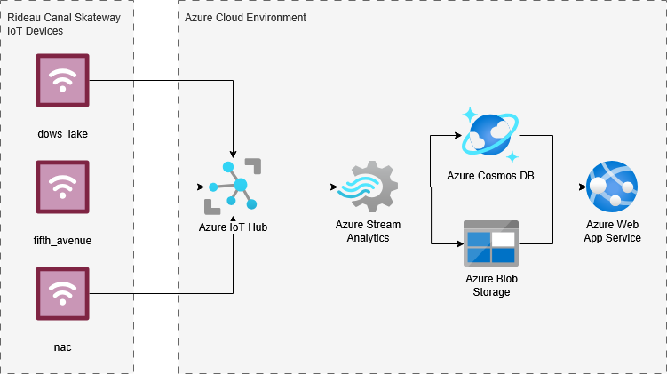

---
### Azure Services

1. IoT Hub
2. Stream Analytics
3. Cosmos DB
4. Blob Storage

### Data Flow

#### IoT Devices

- Simulated IoT devices are deployed at 3 Rideau Canal Skateway areas:
   1. Dow’s Lake
   2. Fifth Avenue
   3. NAC
- Each device monitors four environmental metrics:
   1. Ice Thickness (cm)
   2. Surface Temperature (°C)
   3. Snow Accumulation (cm)
   4. External Temperature (°C)

#### Azure IoT Hub

- 3 devices transmit raw telemetry data to Azure IoT Hub, which acts as the ingestion point for all sensor traffic.

#### Azure Stream Analytics

- Input: Incoming IoT data is processed in real-time using 5-minute tumbling aggregation windows.
- Stream Analytics processes averages, minimums, maximums, and counts for each metric per location.
- Output: Aggregated results is stored in Blob and Cosmos DB containers

#### Azure Cosmos DB

- Aggregated results are written to Cosmos DB, optimized for fast querying with extremely low latency
- Dashboard queries the latest readings from Cosmos DB to display live skate conditions and safety metrics.

#### Azure Blob Storage

- Aggregated results are written to Cosmos DB as historical data
- Supports trend analysis and long-term reporting.

#### Azure Web App Service/Vercel App

- Dash (Plotly) dashboard is hosted on Vercel, visualizing:
   1. Real-time readings and safety badges per location
   2. Historical trend charts on ice temperature and surface temperature
   3. Overall safety/system status
- Queries Cosmos DB for live data and Blob Storage for historical records.

## Implementation Overview

### IoT Sensor Simulation (link to repo)

**URL:** [sensor simulation repo](https://github.com/aliceyangac/rideau-canal-sensor-simulation)

### Azure IoT Hub configuration

### Stream Analytics job (include query)

### Cosmos DB setup

### Blob Storage configuration

### Web Dashboard (link to repo)

### Vercel deployment

1. **Repository Links**
   - Link to sensor simulation repository
   - Link to web dashboard repository
   - Link to live dashboard deployment

2. **Video Demonstration**
   - Embedded video or link

3. **Setup Instructions**
   - Prerequisites
   - High-level setup steps
   - Links to detailed setup in component repos

4. **Results and Analysis**
- Sample outputs and screenshots
  1. IoT Hub with 3 registered devices
 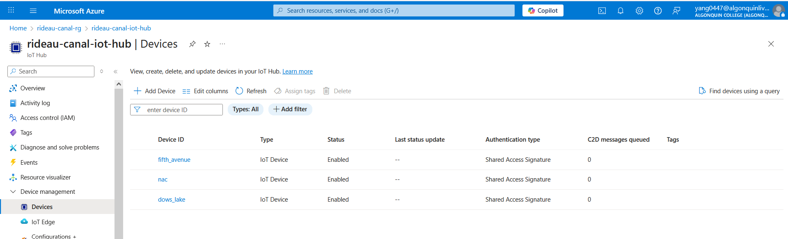
  1. IoT Hub metrics showing messages received
 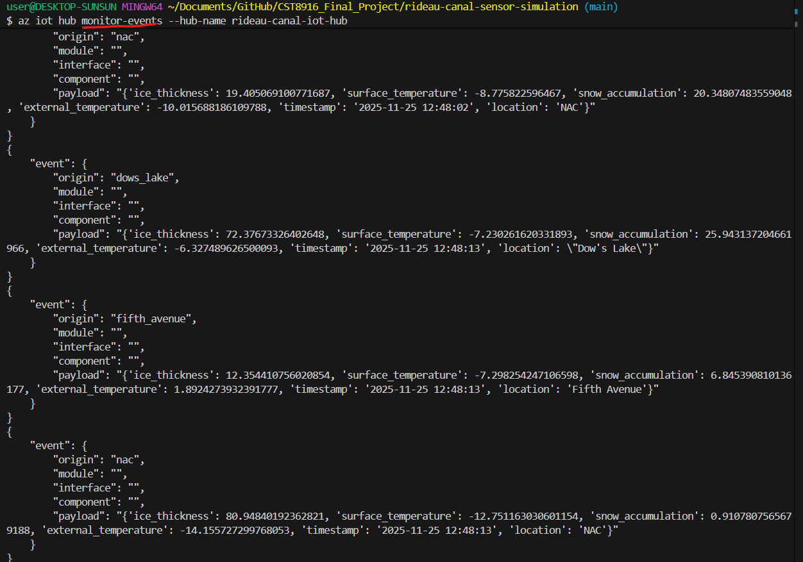
 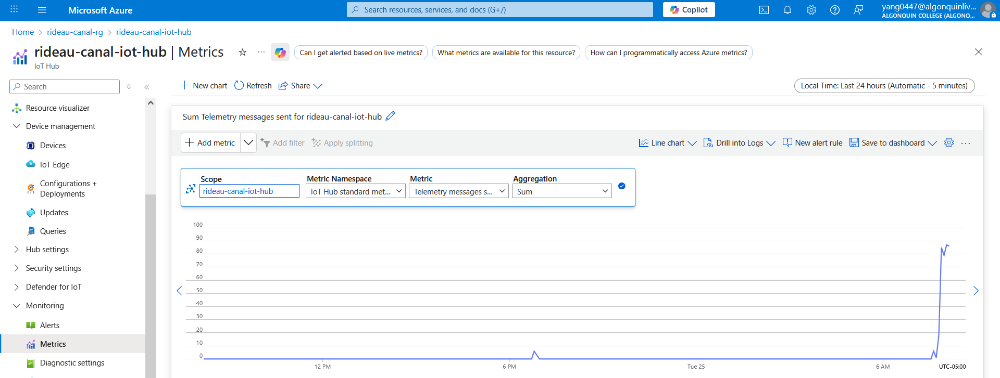
  1. Stream Analytics query editor with your query
 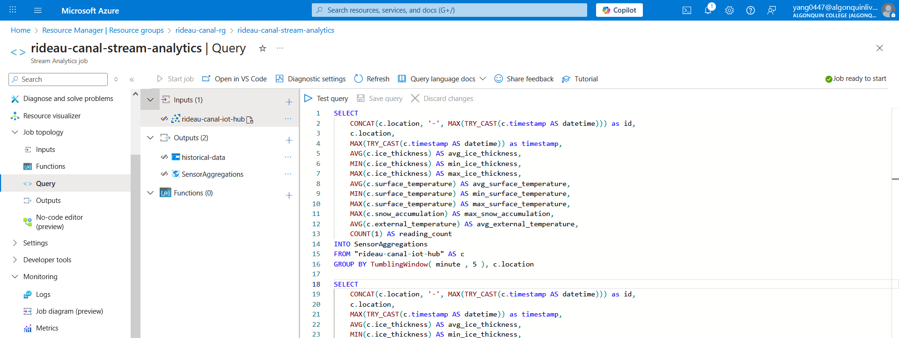
 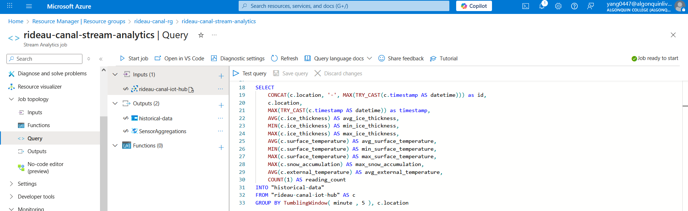
  1. Stream Analytics job in "Running" state
 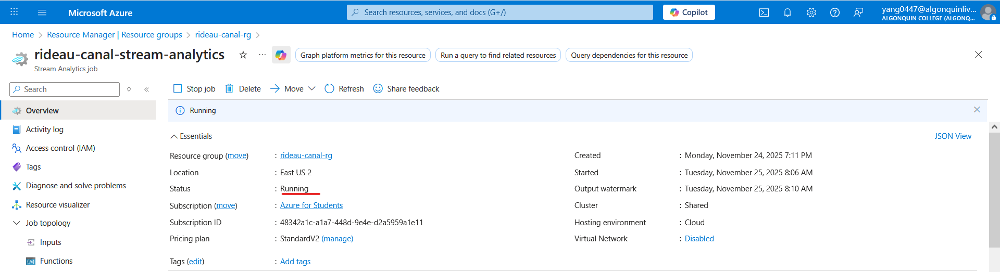
  1. Cosmos DB Data Explorer with sample documents
 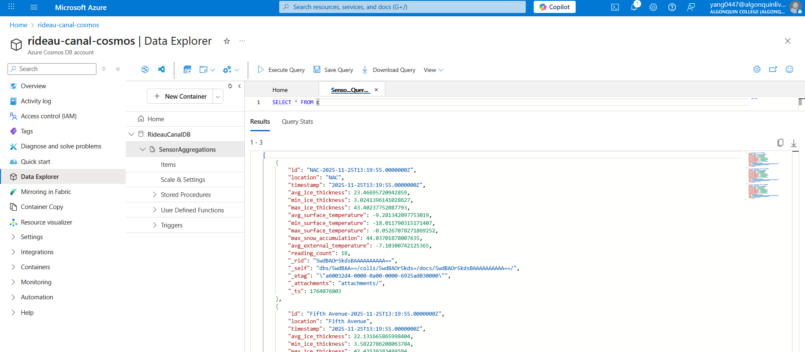
  1. Blob Storage container with archived files
 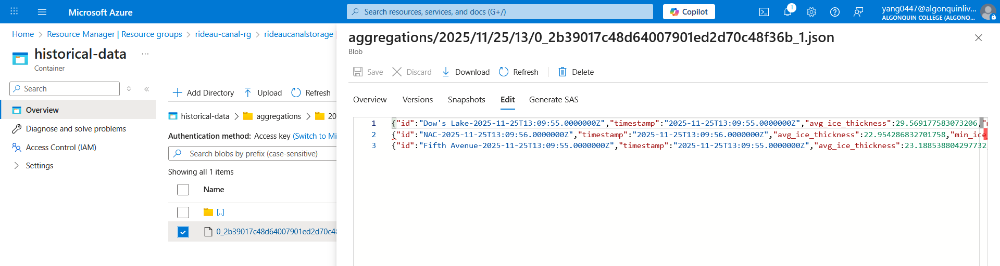
  1. Dashboard running locally (showing live data)
 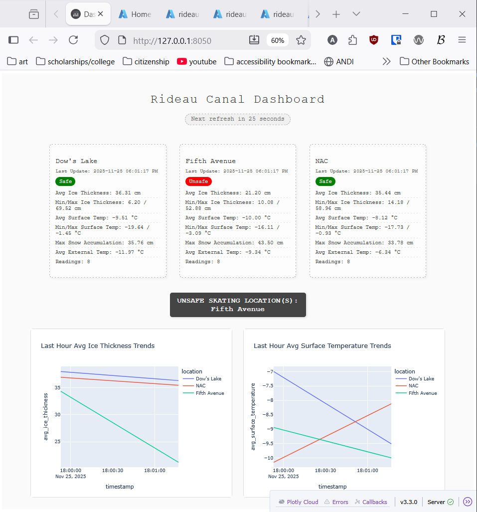
  1. Dashboard deployed on Azure App Service
 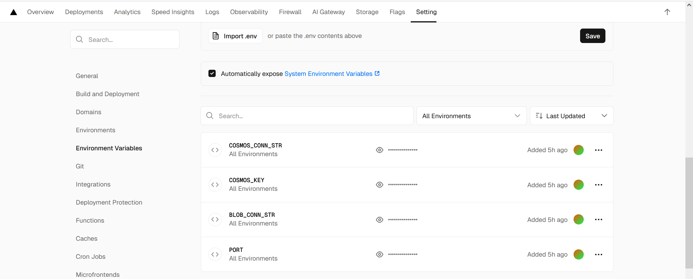
 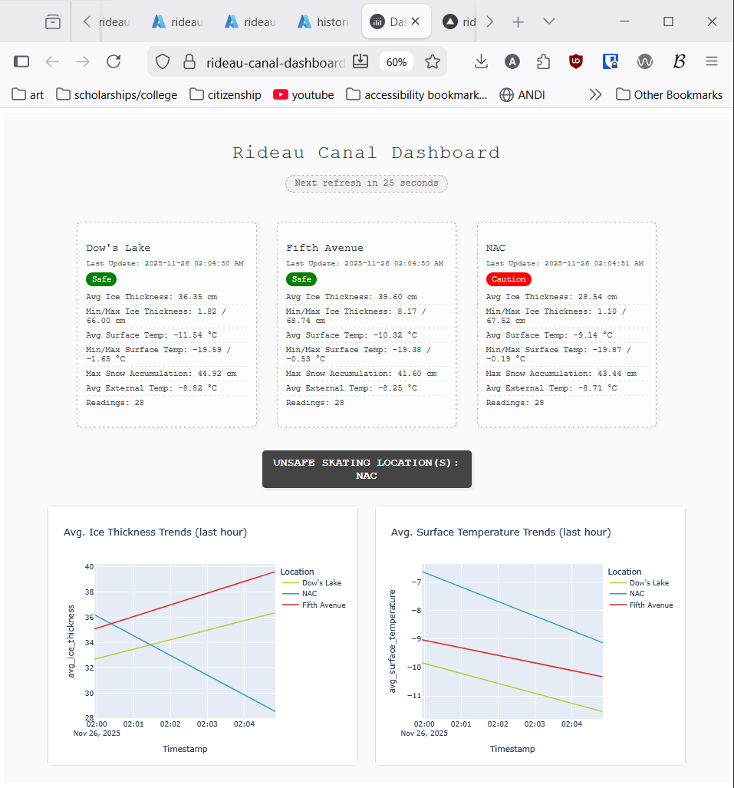
   - Data analysis
   - System performance observations

1.  **Challenges and Solutions**
    - Technical challenges faced
    - How you solved them

2.  **AI Tools Disclosure** (if used)
    - Tools used and how
    - What was AI-generated vs your work

3.  **References**
    - Libraries used
    - Other resources